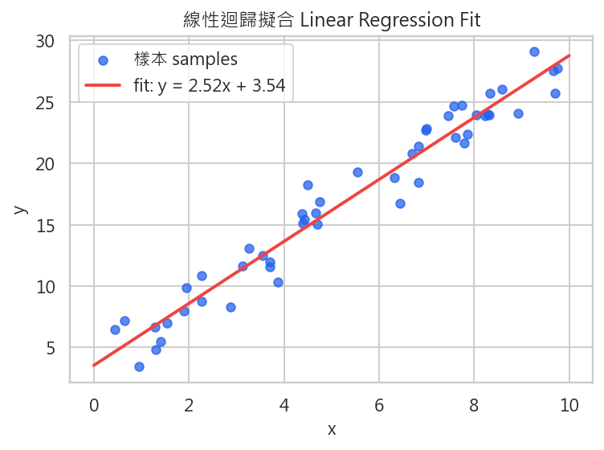
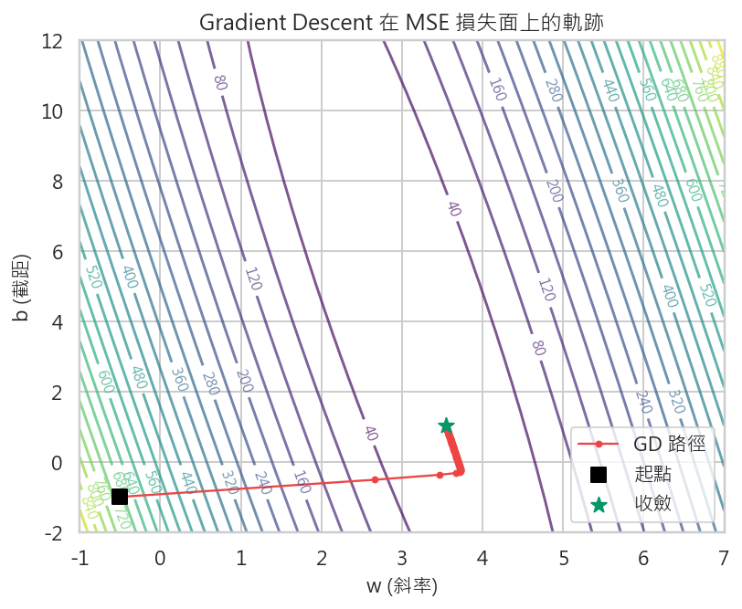

# 第 4 週：線性回歸 — 損失函數、梯度下降視覺化
# Week 4: Linear Regression — Loss Function & Gradient Descent Visualization

## 學習目標 Learning Objectives

1. 理解線性回歸 (Linear Regression) 的數學原理與幾何直覺
2. 推導均方誤差 (Mean Squared Error, MSE) 損失函數及其梯度
3. 掌握梯度下降 (Gradient Descent) 演算法的完整推導與實作
4. 透過 3D 損失地形 (Loss Landscape) 視覺化理解最佳化過程
5. 實驗學習率 (Learning Rate) 對收斂行為的影響
6. 比較批次梯度下降 (Batch GD)、隨機梯度下降 (SGD) 與小批次梯度下降 (Mini-batch GD)
7. 了解正規方程 (Normal Equation) 的封閉解及其與梯度下降的適用時機
8. 掌握殘差分析 (Residual Analysis) 與回歸評估指標
9. 認識多項式回歸 (Polynomial Regression) 與過擬合 (Overfitting) 風險

**先備知識 Prerequisites:** Week 1-3 內容、基礎微積分（偏導數概念）、基礎線性代數（矩陣乘法）

---

## 1. 線性回歸的直覺 Intuition of Linear Regression

### 1.1 什麼是回歸問題？ What is a Regression Problem?

在第 3 週，我們學到監督式學習 (Supervised Learning) 包含兩大任務：**分類 (Classification)** 與**回歸 (Regression)**。當目標變數 (Target Variable) 是連續值 (Continuous Value) 時，我們面對的就是回歸問題。

**生活中的回歸問題：**
- 根據坪數預測房價
- 根據溫度預測冰品銷量
- 根據學習時間預測考試成績
- 根據廣告投放金額預測營收

### 1.2 線性回歸的核心概念

線性回歸的目標是找到一條「最佳擬合線」(Best Fit Line)，使得這條線與所有資料點之間的誤差最小。



**簡單線性回歸 (Simple Linear Regression)** 只有一個特徵 (Feature)：

$$\hat{y} = wx + b$$

其中：
- $\hat{y}$：預測值 (Predicted Value)
- $x$：輸入特徵 (Input Feature)
- $w$：權重 / 斜率 (Weight / Slope)
- $b$：偏差 / 截距 (Bias / Intercept)

**幾何直覺：** 在二維平面上，$w$ 決定直線的傾斜方向與程度，$b$ 決定直線在 y 軸上的起始位置。我們要找的就是最能「穿過」資料點群的那條直線。

---

## 2. 數學推導 Mathematical Derivation

### 2.1 簡單線性回歸 Simple Linear Regression

給定 $n$ 個訓練樣本 $\{(x_1, y_1), (x_2, y_2), \ldots, (x_n, y_n)\}$，線性回歸模型為：

$$\hat{y}_i = wx_i + b, \quad i = 1, 2, \ldots, n$$

**目標：** 找到最佳的 $w^*$ 與 $b^*$，使得預測值 $\hat{y}_i$ 與真實值 $y_i$ 之間的總誤差最小。

### 2.2 多元線性回歸 Multiple Linear Regression

當我們有 $d$ 個特徵時，模型擴展為：

$$\hat{y} = w_1 x_1 + w_2 x_2 + \cdots + w_d x_d + b = \mathbf{w}^T \mathbf{x} + b$$

用矩陣形式表達更加簡潔。定義：
- 設計矩陣 (Design Matrix)：$\mathbf{X} \in \mathbb{R}^{n \times (d+1)}$（每一列為一個樣本，最後一行為全 1 以吸收偏差項）
- 權重向量 (Weight Vector)：$\boldsymbol{\theta} = [w_1, w_2, \ldots, w_d, b]^T \in \mathbb{R}^{d+1}$
- 目標向量 (Target Vector)：$\mathbf{y} \in \mathbb{R}^n$

則模型可以寫為：

$$\hat{\mathbf{y}} = \mathbf{X} \boldsymbol{\theta}$$

### 2.3 簡單 vs 多元的比較

| 面向 | 簡單線性回歸 | 多元線性回歸 |
|------|------------|------------|
| 特徵數 | 1 | $d \geq 2$ |
| 模型 | $\hat{y} = wx + b$ | $\hat{y} = \mathbf{w}^T\mathbf{x} + b$ |
| 幾何意義 | 擬合一條直線 | 擬合一個超平面 (Hyperplane) |
| 參數數量 | 2 個 ($w, b$) | $d + 1$ 個 |
| 視覺化 | 2D 散佈圖 + 直線 | 3D 以上較難直觀呈現 |

---

## 3. 損失函數 Loss Function

### 3.1 為何需要損失函數？

損失函數 (Loss Function)，又稱成本函數 (Cost Function) 或目標函數 (Objective Function)，是衡量模型預測結果與真實值之間差距的數學工具。我們的目標是**最小化**損失函數的值。

> 沒有損失函數，我們就沒有辦法量化「什麼是好的模型」，也無法系統性地改進模型。

### 3.2 均方誤差 Mean Squared Error (MSE)

最常用的回歸損失函數是**均方誤差 (MSE)**：

$$\mathcal{L}_{\text{MSE}}(w, b) = \frac{1}{n} \sum_{i=1}^{n} (y_i - \hat{y}_i)^2 = \frac{1}{n} \sum_{i=1}^{n} (y_i - wx_i - b)^2$$

**為什麼選擇平方？**

1. **消除正負抵消：** 直接加總誤差 $y_i - \hat{y}_i$ 會因正負相消而為零，無法反映真實誤差大小
2. **可微分性 (Differentiability)：** 平方函數處處可微，方便使用梯度下降進行最佳化
3. **放大效果：** 對大誤差的懲罰更重（誤差加倍，損失變四倍），促使模型優先修正大偏差
4. **凸性 (Convexity)：** MSE 對線性回歸參數是嚴格凸函數 (Strictly Convex)，保證存在唯一的全域最小值 (Global Minimum)

**幾何意義：** MSE 等於所有殘差平方的平均值。如果我們在散佈圖上畫出每個資料點到回歸線的垂直距離（殘差），並以此為邊長畫出正方形，MSE 就是所有正方形面積的平均值。

### 3.3 平均絕對誤差 Mean Absolute Error (MAE)

$$\mathcal{L}_{\text{MAE}}(w, b) = \frac{1}{n} \sum_{i=1}^{n} |y_i - \hat{y}_i|$$

**MAE vs MSE 比較：**

| 特性 | MSE | MAE |
|------|-----|-----|
| 對離群值 (Outliers) 敏感度 | 高（平方放大效果） | 低（線性增長） |
| 可微分性 | 處處可微 | 在零點不可微 |
| 梯度特性 | 梯度隨誤差大小變化 | 梯度恆為常數 |
| 常用場景 | 大多數回歸任務 | 需要穩健性的情境 |
| 最佳化難度 | 較容易 | 較難（非平滑） |

### 3.4 Huber 損失 Huber Loss

Huber Loss 結合了 MSE 和 MAE 的優點：

$$\mathcal{L}_{\text{Huber}}(\delta) = \begin{cases} \frac{1}{2}(y - \hat{y})^2 & \text{if } |y - \hat{y}| \leq \delta \\ \delta |y - \hat{y}| - \frac{1}{2}\delta^2 & \text{otherwise} \end{cases}$$

其中 $\delta$ 是一個超參數 (Hyperparameter)，控制從 MSE 行為切換到 MAE 行為的閾值。

- 當誤差小於 $\delta$ 時，行為像 MSE（對小誤差敏感，梯度隨誤差增大）
- 當誤差大於 $\delta$ 時，行為像 MAE（不會被離群值過度影響）

**適用場景：** 資料中可能存在離群值，但仍希望對小誤差保持敏感的情境。

### 3.5 損失函數的選擇指引

```
資料乾淨、無明顯離群值 → MSE
資料含離群值、需要穩健估計 → MAE 或 Huber Loss
不確定 → 先用 MSE，觀察殘差再決定
```

---

## 4. 梯度下降演算法 Gradient Descent Algorithm

### 4.1 最佳化問題的定義

我們的目標是找到使損失函數最小的參數值：

$$w^*, b^* = \arg\min_{w, b} \mathcal{L}(w, b) = \arg\min_{w, b} \frac{1}{n} \sum_{i=1}^{n} (y_i - wx_i - b)^2$$

### 4.2 梯度的直覺 Intuition of Gradient



**梯度 (Gradient)** 是多變數函數在某一點上變化最快的方向。

想像你站在一座山上（損失地形），矇著眼睛想走到谷底（最小值）。你能做的就是：
1. 感受腳下地面的傾斜方向（計算梯度）
2. 往最陡的下坡方向邁出一步（沿負梯度方向更新參數）
3. 重複步驟 1-2，直到到達谷底（收斂）

**數學定義：** 對於損失函數 $\mathcal{L}(w, b)$，梯度是所有偏導數組成的向量：

$$\nabla \mathcal{L} = \left[ \frac{\partial \mathcal{L}}{\partial w}, \frac{\partial \mathcal{L}}{\partial b} \right]$$

### 4.3 MSE 梯度的推導

對 $w$ 求偏導數：

$$\frac{\partial \mathcal{L}}{\partial w} = \frac{\partial}{\partial w} \left[ \frac{1}{n} \sum_{i=1}^{n} (y_i - wx_i - b)^2 \right]$$

利用連鎖律 (Chain Rule)：

$$= \frac{1}{n} \sum_{i=1}^{n} 2(y_i - wx_i - b) \cdot (-x_i)$$

$$= -\frac{2}{n} \sum_{i=1}^{n} (y_i - wx_i - b) \cdot x_i$$

$$= -\frac{2}{n} \sum_{i=1}^{n} (y_i - \hat{y}_i) \cdot x_i$$

同理，對 $b$ 求偏導數：

$$\frac{\partial \mathcal{L}}{\partial b} = -\frac{2}{n} \sum_{i=1}^{n} (y_i - \hat{y}_i)$$

**向量化形式：** 令殘差向量 $\mathbf{e} = \mathbf{y} - \hat{\mathbf{y}}$，則：

$$\frac{\partial \mathcal{L}}{\partial \boldsymbol{\theta}} = -\frac{2}{n} \mathbf{X}^T \mathbf{e}$$

### 4.4 梯度下降更新公式

梯度下降的核心思想：沿著梯度的**反方向**（即損失下降最快的方向）更新參數。

$$w \leftarrow w - \alpha \cdot \frac{\partial \mathcal{L}}{\partial w}$$

$$b \leftarrow b - \alpha \cdot \frac{\partial \mathcal{L}}{\partial b}$$

其中 $\alpha$ 為**學習率 (Learning Rate)**，控制每一步移動的幅度。

**向量化形式：**

$$\boldsymbol{\theta} \leftarrow \boldsymbol{\theta} - \alpha \cdot \nabla \mathcal{L}(\boldsymbol{\theta})$$

### 4.5 完整演算法步驟

```
演算法：梯度下降 (Gradient Descent)
輸入：訓練資料 (X, y)、學習率 alpha、最大迭代次數 max_iter、容忍度 tol
輸出：最佳參數 w*, b*

1. 初始化參數 w = 0, b = 0（或隨機初始化）
2. for epoch = 1, 2, ..., max_iter:
   a. 計算預測值：y_hat = w * X + b
   b. 計算損失：L = (1/n) * sum((y - y_hat)^2)
   c. 計算梯度：
      dw = -(2/n) * sum((y - y_hat) * X)
      db = -(2/n) * sum(y - y_hat)
   d. 更新參數：
      w = w - alpha * dw
      b = b - alpha * db
   e. 若 |L_prev - L| < tol：break（已收斂）
3. 回傳 w, b
```

---

## 5. 學習率的影響 Impact of Learning Rate

學習率 $\alpha$ 是梯度下降中最關鍵的超參數，它決定了每次參數更新的步幅大小。

### 5.1 太大的學習率 (Too Large, e.g., $\alpha = 1.0$)

- 每步跨度太大，直接跳過谷底
- 損失值來回震盪 (Oscillation)，甚至逐漸增大
- 最終**發散 (Divergence)**，損失爆炸到無窮大

```
損失
  ^
  |  *           *
  |    *       *   *
  |      *   *       *  → 越來越大！
  |        *
  +------------------→ 迭代次數
```

### 5.2 太小的學習率 (Too Small, e.g., $\alpha = 0.001$)

- 每步移動很小，需要非常多次迭代
- 收斂速度極慢 (Slow Convergence)
- 雖然最終能到達最佳解，但實務上可能等不到

```
損失
  ^
  |*
  | *
  |  *
  |   *
  |    **
  |      ***
  |         ******* → 非常緩慢地下降
  +------------------→ 迭代次數
```

### 5.3 適當的學習率 (Appropriate, e.g., $\alpha = 0.01$)

- 穩定且快速地下降
- 在合理的迭代次數內收斂
- 損失曲線呈現平滑的指數衰減形狀

```
損失
  ^
  |*
  |  *
  |    *
  |       *
  |          **
  |            *** → 穩定收斂
  +------------------→ 迭代次數
```

### 5.4 學習率選擇策略

| 策略 | 說明 |
|------|------|
| 網格搜尋 (Grid Search) | 嘗試 $\{0.001, 0.003, 0.01, 0.03, 0.1, 0.3, 1.0\}$ 等倍數增長的值 |
| 損失曲線觀察 | 畫出損失 vs 迭代次數的圖，選擇穩定下降的學習率 |
| 學習率排程 (LR Scheduling) | 開始用較大學習率快速下降，逐步降低以精準收斂 |
| 自適應方法 (Adaptive Methods) | 如 Adam、RMSProp 等，自動調整每個參數的學習率 |

---

## 6. 損失地形視覺化 Loss Landscape Visualization

### 6.1 什麼是損失地形？

損失地形是損失函數在參數空間中的「地形圖」。對於簡單線性回歸 $\hat{y} = wx + b$：
- x 軸：權重 $w$
- y 軸：偏差 $b$
- z 軸（高度）：損失值 $\mathcal{L}(w, b)$

由於 MSE 是 $w$ 和 $b$ 的二次函數，損失地形是一個**碗狀 (Bowl-shaped)** 曲面，碗底對應全域最小值。

### 6.2 等高線圖 Contour Plot

等高線圖是損失地形的俯視圖，同一條等高線上的所有點具有相同的損失值。

- 等高線越密集的地方，梯度越大（地形越陡峭）
- 等高線越稀疏的地方，梯度越小（地形越平坦）
- **梯度方向永遠垂直於等高線**

### 6.3 梯度下降軌跡

在等高線圖上，我們可以描繪梯度下降過程中參數 $(w, b)$ 的移動軌跡：
- 起始點通常離最佳解較遠
- 每一步都朝向損失下降最快的方向移動
- 最終軌跡會收斂到等高線的中心（最小值點）

**觀察重點：**
- 學習率太大：軌跡在谷底附近來回跳動
- 學習率適中：軌跡平滑地螺旋或直線趨近中心
- 學習率太小：軌跡非常短，密集地擠在起始點附近

### 6.4 橢圓形等高線與條件數

當不同特徵的尺度差異很大時，等高線會變成狹長的橢圓形，梯度下降會出現「之字形」(Zigzag) 的路徑，導致收斂緩慢。這就是為什麼特徵縮放 (Feature Scaling) 很重要——它能讓等高線更接近圓形，加速收斂。

---

## 7. 梯度下降的變體 Variants of Gradient Descent

### 7.1 批次梯度下降 Batch Gradient Descent (BGD)

每次更新使用**全部** $n$ 個樣本計算梯度：

$$\nabla \mathcal{L} = -\frac{2}{n} \sum_{i=1}^{n} (y_i - \hat{y}_i) \cdot \mathbf{x}_i$$

| 優點 | 缺點 |
|------|------|
| 梯度估計準確，方向穩定 | 大資料集計算成本高 |
| 收斂路徑平滑 | 每一步都需遍歷全部資料 |
| 理論上保證收斂到最佳解 | 記憶體需求大 |

### 7.2 隨機梯度下降 Stochastic Gradient Descent (SGD)

每次更新只使用**一個**隨機樣本計算梯度：

$$\nabla \mathcal{L}_i = -2(y_i - \hat{y}_i) \cdot \mathbf{x}_i$$

| 優點 | 缺點 |
|------|------|
| 計算快，每步只看一個樣本 | 梯度估計噪聲大 |
| 可跳出局部最小值 | 收斂路徑震盪劇烈 |
| 適合線上學習 (Online Learning) | 難以精確收斂到最佳解 |

### 7.3 小批次梯度下降 Mini-batch Gradient Descent

每次更新使用一個**小批次 (Mini-batch)** 的 $m$ 個樣本（通常 $m = 32, 64, 128, 256$）：

$$\nabla \mathcal{L}_B = -\frac{2}{m} \sum_{i \in B} (y_i - \hat{y}_i) \cdot \mathbf{x}_i$$

| 優點 | 缺點 |
|------|------|
| 兼顧效率與穩定性 | 需要調整 batch size |
| 充分利用 GPU 平行計算 | 仍有一定噪聲 |
| 實務中最常使用 | — |

### 7.4 三種方法的比較

```
         準確性          速度          穩定性
BGD:     ★★★★★          ★☆☆☆☆          ★★★★★
SGD:     ★☆☆☆☆          ★★★★★          ★☆☆☆☆
Mini-batch: ★★★★☆       ★★★★☆          ★★★★☆
```

---

## 8. 正規方程 Normal Equation

### 8.1 封閉解推導

對於 MSE 損失函數，我們可以直接令梯度為零來求解：

$$\nabla_{\boldsymbol{\theta}} \mathcal{L} = -\frac{2}{n} \mathbf{X}^T (\mathbf{y} - \mathbf{X}\boldsymbol{\theta}) = \mathbf{0}$$

$$\mathbf{X}^T \mathbf{X} \boldsymbol{\theta} = \mathbf{X}^T \mathbf{y}$$

若 $\mathbf{X}^T \mathbf{X}$ 可逆：

$$\boldsymbol{\theta}^* = (\mathbf{X}^T \mathbf{X})^{-1} \mathbf{X}^T \mathbf{y}$$

這就是**正規方程 (Normal Equation)**，可以一步直接算出最佳解，不需要迭代。

### 8.2 正規方程 vs 梯度下降

| 面向 | 正規方程 | 梯度下降 |
|------|---------|---------|
| 需要選學習率 | 否 | 是 |
| 需要迭代 | 否（一步完成） | 是（多次迭代） |
| 時間複雜度 | $O(d^3)$（矩陣求逆） | $O(knd)$（$k$ 次迭代） |
| 特徵數 $d$ 很大 | 非常慢（$d > 10{,}000$ 時不實際） | 仍然可行 |
| 樣本數 $n$ 很大 | 需載入全部資料 | SGD/Mini-batch 可分批處理 |
| 數值穩定性 | $\mathbf{X}^T\mathbf{X}$ 可能奇異 (Singular) | 通常較穩定 |
| 適用模型 | 僅限線性模型 | 適用任何可微模型 |

**選擇建議：**
- 特徵數少（$d < 10{,}000$）且不要求即時更新 → 正規方程
- 特徵數多或需要線上學習 → 梯度下降
- 非線性模型（神經網路等） → 只能用梯度下降

---

## 9. 殘差分析 Residual Analysis

### 9.1 什麼是殘差？

殘差 (Residual) 是每個資料點的真實值與預測值之間的差異：

$$e_i = y_i - \hat{y}_i$$

### 9.2 殘差圖的解讀

殘差圖 (Residual Plot) 通常以預測值 $\hat{y}$ 為 x 軸、殘差 $e$ 為 y 軸。

**理想的殘差圖：**
- 殘差隨機分散在零線附近
- 沒有明顯的模式 (Pattern)
- 變異性 (Variance) 大致恆定（同質變異性, Homoscedasticity）

**常見的問題模式：**

| 殘差圖模式 | 意涵 | 可能的解法 |
|-----------|------|----------|
| 曲線形 (Curve) | 模型欠擬合，存在非線性關係 | 增加多項式項或使用非線性模型 |
| 喇叭形 (Fan-shaped) | 異質變異性 (Heteroscedasticity) | 對 $y$ 取對數或使用加權回歸 |
| 聚集 (Clusters) | 可能遺漏重要特徵 | 加入新特徵或考慮分群 |
| 離群值 (Outliers) | 極端值影響模型 | 檢查資料品質，考慮使用穩健回歸 |

### 9.3 殘差的常態性檢驗

在統計推論中（如計算信賴區間、假設檢定），我們通常假設殘差服從常態分布 (Normal Distribution)。可以使用：

- **Q-Q 圖 (Quantile-Quantile Plot)：** 若殘差接近常態，點會落在對角線上
- **直方圖 (Histogram)：** 觀察殘差分布是否呈鐘形
- **Shapiro-Wilk 檢定：** 統計檢定殘差是否常態

---

## 10. 回歸評估指標 Regression Evaluation Metrics

### 10.1 均方根誤差 Root Mean Squared Error (RMSE)

$$\text{RMSE} = \sqrt{\frac{1}{n} \sum_{i=1}^{n} (y_i - \hat{y}_i)^2} = \sqrt{\text{MSE}}$$

- 與目標變數同單位，直覺上容易解讀
- 例如：RMSE = 5 萬元，代表預測房價平均偏差約 5 萬元

### 10.2 決定係數 R-squared ($R^2$)

$$R^2 = 1 - \frac{\text{SS}_{\text{res}}}{\text{SS}_{\text{tot}}} = 1 - \frac{\sum_{i=1}^{n}(y_i - \hat{y}_i)^2}{\sum_{i=1}^{n}(y_i - \bar{y})^2}$$

其中：
- $\text{SS}_{\text{res}}$：殘差平方和 (Residual Sum of Squares)
- $\text{SS}_{\text{tot}}$：總平方和 (Total Sum of Squares)
- $\bar{y}$：目標變數的平均值

**解讀：**
- $R^2 = 1$：完美擬合，所有預測值等於真實值
- $R^2 = 0$：模型的表現與直接用平均值預測一樣差
- $R^2 < 0$：模型比平均值預測還差（通常代表嚴重問題）
- $R^2 = 0.85$：模型解釋了 85% 的目標變數變異性

### 10.3 調整決定係數 Adjusted R-squared

$R^2$ 有一個缺點：**加入任何新特徵都不會降低 $R^2$**（即使那個特徵毫無預測力）。調整 $R^2$ 會懲罰不必要的特徵：

$$R^2_{\text{adj}} = 1 - \frac{(1 - R^2)(n - 1)}{n - d - 1}$$

其中 $d$ 是特徵數量。若新增的特徵沒有實質貢獻，$R^2_{\text{adj}}$ 會下降。

### 10.4 指標總覽

| 指標 | 範圍 | 越大/越小越好 | 說明 |
|------|------|-------------|------|
| MSE | $[0, +\infty)$ | 越小越好 | 對大誤差敏感 |
| RMSE | $[0, +\infty)$ | 越小越好 | 與目標同單位 |
| MAE | $[0, +\infty)$ | 越小越好 | 對離群值穩健 |
| $R^2$ | $(-\infty, 1]$ | 越大越好 | 可解釋性高 |
| Adjusted $R^2$ | $(-\infty, 1]$ | 越大越好 | 考慮特徵數量 |

---

## 11. 多項式回歸與過擬合 Polynomial Regression & Overfitting

### 11.1 為何需要多項式回歸？

當資料呈現非線性關係 (Non-linear Relationship) 時，單純的直線無法良好擬合。多項式回歸 (Polynomial Regression) 透過增加特徵的高次項來捕捉非線性模式：

$$\hat{y} = w_0 + w_1 x + w_2 x^2 + w_3 x^3 + \cdots + w_p x^p$$

注意：雖然特徵是 $x$ 的非線性函數，但模型對**參數** $\{w_0, w_1, \ldots, w_p\}$ 仍然是線性的，因此仍屬於線性回歸的框架。

### 11.2 多項式次數的影響

| 次數 (Degree) | 描述 | 風險 |
|---------------|------|------|
| $p = 1$ | 直線擬合 | 可能欠擬合 (Underfitting) |
| $p = 2, 3$ | 適度曲線擬合 | 通常是好的選擇 |
| $p = 10+$ | 高度彈性曲線 | 嚴重過擬合 (Overfitting) |

### 11.3 過擬合的徵兆

- 訓練集上損失很低，但測試集上損失很高
- 模型的曲線穿過每一個訓練點，但在訓練點之間劇烈波動
- 模型參數的絕對值非常大

### 11.4 視覺化理解

在本週的 Notebook 中，我們將比較 degree=1, 3, 10 的多項式回歸：
- **degree=1（欠擬合）：** 直線無法捕捉資料中的彎曲趨勢
- **degree=3（適當擬合）：** 曲線平滑地追蹤資料的主要趨勢
- **degree=10（過擬合）：** 曲線劇烈扭曲以穿過每個訓練點，但泛化能力極差

### 11.5 應對過擬合的方法

1. **增加訓練資料量**
2. **正則化 (Regularization)：** 在損失函數中加入懲罰項（如 Ridge/Lasso，將在後續週次介紹）
3. **降低模型複雜度：** 選擇較低的多項式次數
4. **交叉驗證 (Cross-Validation)：** 使用第 3 週學的 k-Fold CV 來選擇最佳的多項式次數

---

## 12. 本週視覺化重點回顧

本週是課程中最重要的視覺化主題之一。以下是你應該能夠透過視覺化理解的概念：

1. **散佈圖 + 回歸線：** 直覺理解線性回歸的擬合效果
2. **殘差的正方形：** MSE 的幾何意義
3. **3D 損失地形：** 碗狀曲面，理解為何 MSE 有唯一最小值
4. **等高線圖 + 梯度下降軌跡：** 觀察不同學習率下的收斂行為
5. **損失曲線 (Loss Curve)：** 損失值隨迭代次數的變化
6. **殘差圖：** 診斷模型假設是否成立
7. **多項式曲線比較：** 欠擬合 vs 適當擬合 vs 過擬合

---

## 關鍵詞彙 Glossary

| 中文 | 英文 | 說明 |
|------|------|------|
| 線性回歸 | Linear Regression | 用線性函數擬合資料的監督式學習方法 |
| 損失函數 | Loss Function / Cost Function | 衡量模型預測誤差的函數 |
| 均方誤差 | Mean Squared Error (MSE) | 殘差平方的平均值 |
| 平均絕對誤差 | Mean Absolute Error (MAE) | 殘差絕對值的平均值 |
| Huber 損失 | Huber Loss | 結合 MSE 與 MAE 的穩健損失函數 |
| 梯度 | Gradient | 多變數函數在某點的最大變化率方向 |
| 梯度下降 | Gradient Descent | 沿負梯度方向迭代更新參數的最佳化方法 |
| 學習率 | Learning Rate | 控制每次參數更新步幅的超參數 |
| 損失地形 | Loss Landscape | 損失函數在參數空間中的曲面 |
| 等高線圖 | Contour Plot | 損失地形的俯視圖 |
| 批次梯度下降 | Batch Gradient Descent (BGD) | 使用全部樣本計算梯度 |
| 隨機梯度下降 | Stochastic Gradient Descent (SGD) | 使用單一隨機樣本計算梯度 |
| 小批次梯度下降 | Mini-batch Gradient Descent | 使用一小批樣本計算梯度 |
| 正規方程 | Normal Equation | 線性回歸的封閉解公式 |
| 殘差 | Residual | 真實值與預測值的差異 |
| 決定係數 | R-squared ($R^2$) | 衡量模型解釋目標變異性的比例 |
| 調整決定係數 | Adjusted R-squared | 考慮特徵數量的修正 $R^2$ |
| 均方根誤差 | Root Mean Squared Error (RMSE) | MSE 的平方根，與目標同單位 |
| 多項式回歸 | Polynomial Regression | 使用特徵的高次項進行回歸 |
| 過擬合 | Overfitting | 模型過度適應訓練資料，泛化能力差 |
| 欠擬合 | Underfitting | 模型過於簡單，無法捕捉資料規律 |
| 收斂 | Convergence | 參數更新逐漸趨於穩定的過程 |
| 發散 | Divergence | 損失值不斷增大，參數無法穩定 |
| 凸函數 | Convex Function | 任意兩點連線上的值大於函數值的函數 |
| 全域最小值 | Global Minimum | 函數在整個定義域上的最小值 |
| 特徵縮放 | Feature Scaling | 將特徵值標準化到相近範圍 |
| 同質變異性 | Homoscedasticity | 殘差的變異性恆定 |
| 異質變異性 | Heteroscedasticity | 殘差的變異性隨預測值改變 |

---

## 延伸閱讀 Further Reading

- Andrew Ng, Stanford CS229 Lecture Notes: Linear Regression & Gradient Descent
- Bishop, C. M. (2006). *Pattern Recognition and Machine Learning*, Chapter 3: Linear Models for Regression
- Goodfellow, I. et al. (2016). *Deep Learning*, Chapter 4: Numerical Computation (Gradient-Based Optimization)
- scikit-learn 官方文件 — LinearRegression: https://scikit-learn.org/stable/modules/linear_model.html
- 3Blue1Brown — "Gradient Descent, How Neural Networks Learn" (YouTube)
- Distill.pub — "Why Momentum Really Works": https://distill.pub/2017/momentum/
