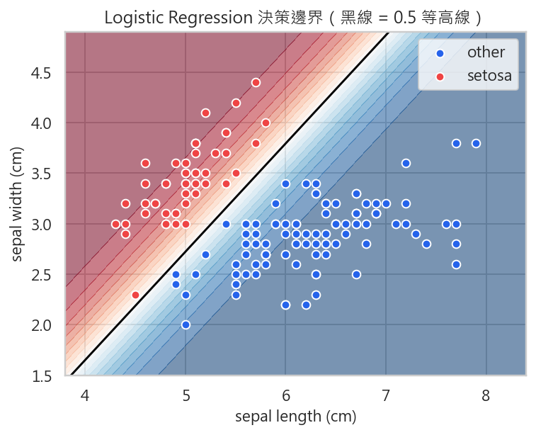
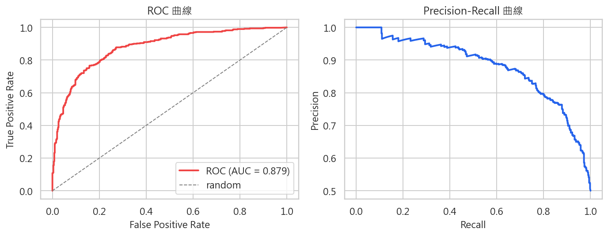

# 第 5 週：分類 — 邏輯迴歸、決策邊界與 ROC/PR 曲線
# Week 5: Classification — Logistic Regression, Decision Boundary & ROC/PR Curves

## 學習目標 Learning Objectives
1. 理解邏輯迴歸 (Logistic Regression) 與 Sigmoid 函數的數學原理
2. 掌握從回歸到分類的轉變思路與機率解釋 (Probabilistic Interpretation)
3. 透過視覺化觀察決策邊界 (Decision Boundary) 的形成與變化
4. 理解二元交叉熵損失 (Binary Cross-Entropy Loss) 的推導與意義
5. 掌握分類評估指標：Accuracy、Precision、Recall、F1-Score
6. 學會繪製與解讀 ROC 曲線及 PR 曲線
7. 了解不平衡資料集 (Imbalanced Dataset) 的處理策略
8. 認識多類別分類 (Multi-class Classification) 的擴展方法

---

## 1. 從回歸到分類 From Regression to Classification

### 1.1 回顧：線性回歸的限制 Limitations of Linear Regression

在第 4 週，我們學習了線性回歸 (Linear Regression)，它的輸出是一個連續值：

$$\hat{y} = w^T x + b$$

但當我們面對**分類問題 (Classification Problem)** 時——例如判斷一封郵件是否為垃圾郵件 (Spam)、一張照片是否包含貓——我們需要的是**離散的類別標籤** (Discrete Class Labels)。

如果直接用線性回歸做分類，會遇到以下問題：

| 問題 | 說明 |
|------|------|
| 輸出範圍無限 | 線性回歸輸出可以是任意實數，而分類的目標是 0 或 1 |
| 對離群值敏感 | 極端值會嚴重拉偏決策邊界 |
| 缺乏機率解釋 | 輸出無法直接解釋為「屬於某類別的機率」 |

### 1.2 分類問題的類型 Types of Classification

| 類型 | 英文 | 類別數 | 範例 |
|------|------|--------|------|
| 二元分類 | Binary Classification | 2 | 垃圾郵件偵測、疾病診斷 |
| 多類別分類 | Multi-class Classification | > 2 | 手寫數字辨識 (0-9)、影像分類 |
| 多標籤分類 | Multi-label Classification | 多個 | 一篇文章可同時屬於多個主題 |

### 1.3 我們需要什麼？ What Do We Need?

一個能將線性組合映射 (Map) 到 **[0, 1] 區間**的函數，使輸出具有**機率意義**。這就是 Sigmoid 函數登場的時刻。

---

## 2. 邏輯迴歸 Logistic Regression

### 2.1 Sigmoid 函數（Logistic Function）

Sigmoid 函數將任意實數映射到 (0, 1) 區間：

$$\sigma(z) = \frac{1}{1 + e^{-z}}$$

其中 $z = w^T x + b$ 是線性組合（也稱為 logit）。

**Sigmoid 的重要性質：**

| 性質 | 數學表達 | 意義 |
|------|----------|------|
| 值域 (Range) | $(0, 1)$ | 可解釋為機率 |
| 對稱性 (Symmetry) | $\sigma(-z) = 1 - \sigma(z)$ | 關於 (0, 0.5) 中心對稱 |
| 導數 (Derivative) | $\sigma'(z) = \sigma(z)(1 - \sigma(z))$ | 便於梯度計算 |
| 單調遞增 (Monotonic) | $z$ 越大，$\sigma(z)$ 越接近 1 | 保留排序 |
| 飽和區 (Saturation) | $|z|$ 很大時梯度趨近 0 | 梯度消失問題的根源 |

```
         1 ─────────────────────── ·····
                              ····
                           ···
                        ··
         0.5 ─────── ·· ──────────────
                   ··
                ···
             ····
         0 ·····────────────────────
            -6  -4  -2   0   2   4   6
```

### 2.2 邏輯迴歸模型 The Logistic Regression Model

邏輯迴歸的完整公式為：

$$P(y=1 | x) = \sigma(w^T x + b) = \frac{1}{1 + e^{-(w^T x + b)}}$$

- $P(y=1|x)$：給定輸入 $x$，預測為正類 (Positive Class) 的機率
- $P(y=0|x) = 1 - P(y=1|x)$：預測為負類 (Negative Class) 的機率
- $w$：權重向量 (Weight Vector)
- $b$：偏置項 (Bias Term)

### 2.3 勝算比與 Logit Odds Ratio and Logit

邏輯迴歸有一個優雅的數學解釋：

**勝算 (Odds):** 正事件發生的機率與不發生的機率之比：

$$\text{Odds} = \frac{P(y=1|x)}{P(y=0|x)} = \frac{P(y=1|x)}{1 - P(y=1|x)}$$

**對數勝算 (Log-Odds / Logit):**

$$\text{logit}(p) = \ln\left(\frac{p}{1-p}\right) = w^T x + b$$

這表示邏輯迴歸其實是在**對數勝算空間 (Log-Odds Space)** 中建立線性模型。每個特徵的權重 $w_i$ 代表：當 $x_i$ 增加一個單位時，對數勝算增加 $w_i$。

---

## 3. 機率解釋 Probabilistic Interpretation

### 3.1 最大似然估計 Maximum Likelihood Estimation (MLE)

邏輯迴歸的參數學習採用**最大似然估計 (MLE)**。給定 $N$ 個訓練樣本 $\{(x_i, y_i)\}_{i=1}^{N}$，似然函數 (Likelihood Function) 為：

$$L(w, b) = \prod_{i=1}^{N} P(y_i | x_i; w, b)$$

其中：

$$P(y_i | x_i) = \hat{p}_i^{y_i} (1 - \hat{p}_i)^{1 - y_i}$$

- 當 $y_i = 1$ 時，$P = \hat{p}_i$（希望 $\hat{p}_i$ 越大越好）
- 當 $y_i = 0$ 時，$P = 1 - \hat{p}_i$（希望 $\hat{p}_i$ 越小越好）

### 3.2 對數似然 Log-Likelihood

取對數後，乘法變加法，更易於最佳化：

$$\ell(w, b) = \sum_{i=1}^{N} \left[ y_i \ln \hat{p}_i + (1 - y_i) \ln(1 - \hat{p}_i) \right]$$

最大化對數似然等價於最小化**負對數似然 (Negative Log-Likelihood, NLL)**，也就是我們接下來要介紹的二元交叉熵損失。

---

## 4. 二元交叉熵損失 Binary Cross-Entropy Loss (BCE Loss)

### 4.1 損失函數定義 Loss Function Definition

$$\mathcal{L}(w, b) = -\frac{1}{N} \sum_{i=1}^{N} \left[ y_i \ln \hat{p}_i + (1 - y_i) \ln(1 - \hat{p}_i) \right]$$

其中 $\hat{p}_i = \sigma(w^T x_i + b)$。

### 4.2 直覺理解 Intuitive Understanding

| 真實標籤 $y$ | 預測 $\hat{p}$ | 損失 | 說明 |
|:---:|:---:|:---:|------|
| 1 | 0.99 | $-\ln(0.99) \approx 0.01$ | 預測正確，損失極小 |
| 1 | 0.01 | $-\ln(0.01) \approx 4.6$ | 預測錯誤，損失極大 |
| 0 | 0.01 | $-\ln(0.99) \approx 0.01$ | 預測正確，損失極小 |
| 0 | 0.99 | $-\ln(0.01) \approx 4.6$ | 預測錯誤，損失極大 |

重點：BCE Loss 對**高信心的錯誤預測**施加極大懲罰 (Penalty)，這促使模型在不確定時保持謙遜的預測。

### 4.3 與 MSE 的比較 Comparison with MSE

| 特性 | BCE Loss | MSE Loss |
|------|----------|----------|
| 適用場景 | 分類問題 | 回歸問題 |
| 梯度行為 | 錯誤越大梯度越大（利於學習） | Sigmoid 飽和時梯度消失 |
| 凸性 (Convexity) | 對邏輯迴歸是凸函數 | 搭配 Sigmoid 為非凸 |
| 資訊論基礎 | 來自交叉熵 (Cross-Entropy) | 來自高斯分布假設 |

### 4.4 梯度計算 Gradient Computation

BCE Loss 對參數的梯度恰好有非常簡潔的形式：

$$\frac{\partial \mathcal{L}}{\partial w_j} = \frac{1}{N} \sum_{i=1}^{N} (\hat{p}_i - y_i) x_{ij}$$

$$\frac{\partial \mathcal{L}}{\partial b} = \frac{1}{N} \sum_{i=1}^{N} (\hat{p}_i - y_i)$$

這個梯度的形式與線性回歸非常相似！差別在於 $\hat{p}_i$ 是經過 Sigmoid 函數的輸出。

---

## 5. 決策邊界 Decision Boundary

### 5.1 決策邊界的形成 Formation of Decision Boundary

邏輯迴歸使用一個**閾值 (Threshold)** $\tau$（通常為 0.5）來做最終預測：

$$\hat{y} = \begin{cases} 1 & \text{if } \sigma(w^T x + b) \geq \tau \\ 0 & \text{if } \sigma(w^T x + b) < \tau \end{cases}$$

當 $\tau = 0.5$ 時，決策邊界正好是 $w^T x + b = 0$ 這條超平面 (Hyperplane)。

- 在 2D 空間中，決策邊界是一條**直線 (Line)**
- 在 3D 空間中，決策邊界是一個**平面 (Plane)**
- 在更高維空間中，決策邊界是一個**超平面 (Hyperplane)**



### 5.2 視覺化理解 Visual Understanding

在二維特徵空間 $(x_1, x_2)$ 中：

$$w_1 x_1 + w_2 x_2 + b = 0$$

```
  x2
   ^
   |  ×  ×     |  ●  ●
   |    ×   ×  |    ●  ●
   |  ×   ×    |  ●    ●
   |     ×     |    ●
   |  ×    ×   |  ●   ●
   +───────────┼──────────> x1
            Decision
            Boundary
   × : 類別 0       ● : 類別 1
```

### 5.3 正則化參數 C 的影響 Effect of Regularization Parameter C

在 scikit-learn 中，邏輯迴歸的參數 `C` 是正則化強度的倒數 ($C = 1/\lambda$)：

| C 值 | 正則化程度 | 決策邊界特性 | 風險 |
|------|------------|------------|------|
| 小 (如 0.01) | 強正則化 | 邊界較平滑簡單 | 可能欠擬合 (Underfitting) |
| 中 (如 1.0) | 適度正則化 | 平衡複雜度與擬合 | 通常表現良好 |
| 大 (如 100) | 弱正則化 | 邊界可能過度彎曲 | 可能過擬合 (Overfitting) |

### 5.4 線性不可分問題 Linearly Inseparable Problems

邏輯迴歸的決策邊界本質上是線性的。對於線性不可分 (Linearly Inseparable) 的資料，可以：

1. **添加多項式特徵 (Polynomial Features)**：如 $x_1^2, x_2^2, x_1 x_2$
2. **使用核方法 (Kernel Methods)**：將資料映射到高維空間
3. **換用非線性模型**：如決策樹 (Decision Tree)、神經網路 (Neural Network)

---

## 6. 閾值選擇 Threshold Selection

### 6.1 閾值的影響 Impact of Threshold

邏輯迴歸的輸出是機率值 $\hat{p} \in (0, 1)$，將其轉換為類別預測需要選擇一個閾值 $\tau$。**閾值的選擇直接影響模型的行為：**

| 閾值 $\tau$ | Precision 變化 | Recall 變化 | 適用場景 |
|:-----------:|:--------------:|:-----------:|----------|
| 降低 (如 0.3) | 下降 | 上升 | 疾病篩檢（不想漏掉病患） |
| 預設 (0.5) | 平衡 | 平衡 | 一般分類 |
| 提高 (如 0.7) | 上升 | 下降 | 垃圾郵件（不想誤判正常郵件） |

### 6.2 選擇閾值的策略 Strategies for Threshold Selection

1. **最大化 F1-Score**：在 Precision-Recall 曲線上找 F1 最大的點
2. **業務需求驅動**：根據錯誤類型的成本 (Cost) 來決定
3. **Youden's J 統計量**：$J = \text{Sensitivity} + \text{Specificity} - 1$，在 ROC 曲線上找 J 最大的點
4. **成本敏感閾值 (Cost-Sensitive Threshold)**：考慮 False Positive 與 False Negative 的不同代價

### 6.3 實務案例 Practical Examples

**醫療診斷 Medical Diagnosis：** 漏診（False Negative）的代價遠大於誤診（False Positive），因此應**降低閾值**以提高 Recall。

**詐欺偵測 Fraud Detection：** 漏掉詐欺交易的代價很高，但誤判太多正常交易也會造成客戶困擾，需要根據業務成本做平衡。

---

## 7. 分類評估指標 Classification Evaluation Metrics

### 7.1 混淆矩陣 Confusion Matrix

混淆矩陣是分類評估的基石，記錄了模型預測與真實標籤的對應關係：

|  | 預測正 Predicted Positive | 預測負 Predicted Negative |
|:---:|:---:|:---:|
| **實際正 Actual Positive** | TP (True Positive) 真正例 | FN (False Negative) 偽反例 |
| **實際負 Actual Negative** | FP (False Positive) 偽正例 | TN (True Negative) 真反例 |

**記憶口訣：**
- **T/F**：預測是否正確 (True = 正確，False = 錯誤)
- **P/N**：模型的預測結果 (Positive = 預測正，Negative = 預測負)

### 7.2 核心指標 Core Metrics

**準確率 Accuracy：**

$$\text{Accuracy} = \frac{TP + TN}{TP + TN + FP + FN}$$

整體預測正確的比例。在資料平衡時有用，但**不平衡時會嚴重誤導**。

> 例：在 1000 人中只有 10 人患病，一個「全部預測為健康」的模型 Accuracy = 99%，但完全沒有診斷能力。

**精確率 Precision：**

$$\text{Precision} = \frac{TP}{TP + FP}$$

在所有預測為正的樣本中，有多少是真正的正樣本。回答的問題是：「模型說是正的，有多可靠？」

**召回率 Recall（也叫靈敏度 Sensitivity / 真正例率 True Positive Rate, TPR）：**

$$\text{Recall} = \frac{TP}{TP + FN}$$

在所有真正的正樣本中，有多少被模型找出來。回答的問題是：「真正的正樣本，模型抓到了多少？」

**F1-Score：**

$$F_1 = 2 \cdot \frac{\text{Precision} \cdot \text{Recall}}{\text{Precision} + \text{Recall}}$$

Precision 和 Recall 的調和平均數 (Harmonic Mean)。當兩者都高時 F1 才高，適合作為綜合指標。

### 7.3 F-beta Score

更一般的版本，允許調整 Precision 和 Recall 的權重：

$$F_\beta = (1 + \beta^2) \cdot \frac{\text{Precision} \cdot \text{Recall}}{\beta^2 \cdot \text{Precision} + \text{Recall}}$$

- $\beta = 1$：F1-Score，Precision 和 Recall 等權重
- $\beta = 2$：F2-Score，更重視 Recall（如醫療診斷）
- $\beta = 0.5$：F0.5-Score，更重視 Precision（如搜尋引擎排名）

### 7.4 其他重要指標 Other Important Metrics

**特異度 Specificity（真反例率 True Negative Rate, TNR）：**

$$\text{Specificity} = \frac{TN}{TN + FP}$$

在所有真正的負樣本中，有多少被正確識別為負。

**偽正例率 False Positive Rate (FPR)：**

$$\text{FPR} = \frac{FP}{FP + TN} = 1 - \text{Specificity}$$

**Matthews 相關係數 Matthews Correlation Coefficient (MCC)：**

$$\text{MCC} = \frac{TP \cdot TN - FP \cdot FN}{\sqrt{(TP+FP)(TP+FN)(TN+FP)(TN+FN)}}$$

MCC 的範圍是 [-1, 1]，被認為是不平衡資料下最平衡的單一指標。

---

## 8. ROC 曲線 Receiver Operating Characteristic Curve

### 8.1 什麼是 ROC 曲線？ What is an ROC Curve?



ROC 曲線是以**偽正例率 (FPR)** 為橫軸、**真正例率 (TPR / Recall)** 為縱軸繪製的曲線。它展示了在不同閾值下，模型的 TPR 和 FPR 之間的權衡 (Trade-off)。

```
  TPR (Recall)
   1 ┌─────────────────────┐
     │       ╭───────────  │  完美分類器
     │      ╱              │
     │    ╱    ROC 曲線     │
     │   ╱                 │
     │  ╱                  │
     │ ╱                   │
     │╱   隨機猜測           │
   0 └─────────────────────┘
     0                     1
              FPR
```

### 8.2 AUC 的意義 Meaning of AUC

**AUC (Area Under the ROC Curve)** 是 ROC 曲線下的面積，範圍 [0, 1]：

| AUC 值 | 模型品質 | 解釋 |
|:------:|:--------:|------|
| 1.0 | 完美 | 存在一個閾值可以完美分類 |
| 0.9-1.0 | 極優 (Excellent) | 模型具有很強的區分能力 |
| 0.8-0.9 | 良好 (Good) | 實務中通常可接受 |
| 0.7-0.8 | 尚可 (Fair) | 可能需要改進 |
| 0.5-0.7 | 差 (Poor) | 區分能力弱 |
| 0.5 | 無用 | 等同隨機猜測 |
| < 0.5 | 反向 | 預測方向相反，將標籤翻轉後可改善 |

**AUC 的統計解釋：** AUC 等於隨機抽取一個正樣本和一個負樣本，模型給正樣本更高分數的機率。

### 8.3 ROC 曲線的優缺點 Pros and Cons

**優點：**
- 不依賴閾值選擇
- 對類別比例不敏感（FPR 和 TPR 分別在正/負樣本內計算）
- 適合比較不同模型的整體性能

**缺點：**
- 在**極度不平衡**的資料中可能過於樂觀
- FPR 的分母是負樣本數，當負樣本非常多時，即使 FP 數量很大，FPR 仍然很小

---

## 9. PR 曲線 Precision-Recall Curve

### 9.1 什麼是 PR 曲線？ What is a PR Curve?

PR 曲線以 **Recall** 為橫軸、**Precision** 為縱軸。

```
  Precision
   1 ┌─────────────────────┐
     │\                    │
     │ \                   │
     │  ╲  PR 曲線          │
     │   ╲                 │
     │    ╲───╲            │
     │         ╲───╲       │
     │              ╲──    │
   0 └─────────────────────┘
     0                     1
              Recall
```

### 9.2 Average Precision (AP)

AP 是 PR 曲線下的面積，類似 AUC 但用於 PR 曲線：

$$\text{AP} = \sum_{n} (R_n - R_{n-1}) P_n$$

AP 越高，模型在各種 Recall 水準下都能維持高 Precision。

### 9.3 ROC vs. PR：何時用哪個？ When to Use Which?

| 情境 | 推薦曲線 | 原因 |
|------|:--------:|------|
| 資料平衡 | ROC | 兩者都合適，ROC 更常見 |
| 資料嚴重不平衡 | **PR** | PR 對少數類的表現更敏感 |
| 關注正類的偵測品質 | **PR** | Precision 和 Recall 都聚焦於正類 |
| 需要比較不同模型的整體排序能力 | ROC | AUC 有直觀的統計解釋 |

**為什麼不平衡資料要用 PR 曲線？**

考慮一個有 1000 個負樣本和 10 個正樣本的資料集：
- 即使模型產生 100 個 False Positive，$\text{FPR} = 100/1000 = 0.1$，看起來還不錯
- 但此時 $\text{Precision} = 10/(10+100) = 0.09$，非常糟糕

PR 曲線直接暴露了這個問題，而 ROC 曲線可能掩蓋它。

---

## 10. 不平衡資料集處理 Handling Imbalanced Datasets

### 10.1 什麼是不平衡資料？ What is Imbalanced Data?

不平衡資料集指的是各類別的樣本數量差異顯著的資料集。例如：

| 應用場景 | 正類比例 | 不平衡比 |
|----------|:--------:|:--------:|
| 信用卡詐欺偵測 | ~0.17% | ~1:600 |
| 罕見疾病診斷 | ~1% | ~1:100 |
| 網路入侵偵測 | ~5% | ~1:20 |

### 10.2 不平衡的影響 Impact of Imbalance

- 模型傾向預測多數類 (Majority Class)
- Accuracy 指標失效（「全猜多數類」策略也能得到高 Accuracy）
- 少數類 (Minority Class) 的 Recall 極低

### 10.3 處理策略 Handling Strategies

#### 策略一：資料層面 Data-Level

**過採樣 (Oversampling)：** 增加少數類的樣本數

- **隨機過採樣 (Random Oversampling)**：隨機複製少數類樣本。簡單但容易過擬合。
- **SMOTE (Synthetic Minority Over-sampling Technique)**：在少數類樣本之間插值生成新的合成樣本。

SMOTE 演算法：
1. 對每個少數類樣本，找 $k$ 個最近鄰 (Nearest Neighbors)
2. 隨機選擇一個近鄰
3. 在兩者之間的線段上隨機取一個點作為新樣本

$$x_{\text{new}} = x_i + \lambda \cdot (x_{\text{neighbor}} - x_i), \quad \lambda \in [0, 1]$$

**欠採樣 (Undersampling)：** 減少多數類的樣本數

- **隨機欠採樣 (Random Undersampling)**：隨機移除多數類樣本。簡單但可能丟失重要資訊。
- **Tomek Links**：移除形成 Tomek Link 的多數類樣本（最近鄰屬於不同類別的樣本對），清理邊界區域。

#### 策略二：演算法層面 Algorithm-Level

**類別加權 (Class Weighting)：** 在損失函數中給少數類更大的權重

$$\mathcal{L} = -\frac{1}{N} \sum_{i=1}^{N} \left[ w_1 \cdot y_i \ln \hat{p}_i + w_0 \cdot (1-y_i) \ln(1-\hat{p}_i) \right]$$

在 scikit-learn 中，設定 `class_weight='balanced'` 即可自動計算權重：

$$w_c = \frac{N}{K \cdot N_c}$$

其中 $N$ 是總樣本數，$K$ 是類別數，$N_c$ 是類別 $c$ 的樣本數。

#### 策略三：評估層面 Evaluation-Level

- 使用 PR 曲線而非 ROC 曲線
- 關注 F1-Score 或 MCC 而非 Accuracy
- 使用分層抽樣 (Stratified Sampling) 進行交叉驗證

---

## 11. 多類別分類 Multi-class Classification

### 11.1 One-vs-Rest (OvR / OvA)

**策略：** 訓練 $K$ 個二元分類器，每個分類器負責區分「第 $k$ 類 vs. 其他所有類」。

- 對於 $K$ 個類別，訓練 $K$ 個模型
- 預測時選擇信心分數最高的分類器對應的類別

$$\hat{y} = \arg\max_k f_k(x)$$

### 11.2 One-vs-One (OvO)

**策略：** 訓練 $\binom{K}{2} = \frac{K(K-1)}{2}$ 個二元分類器，每個分類器負責區分兩個類別。

- 預測時採用投票 (Voting)：每個分類器投一票，得票最多的類別獲勝
- 優點：每個分類器只需要兩個類別的資料，訓練更快
- 缺點：分類器數量隨類別數平方增長

### 11.3 Softmax 回歸 Softmax Regression (Multinomial Logistic Regression)

**Softmax 函數**將 $K$ 個分數 (Logits) 轉換為機率分布：

$$P(y = k | x) = \frac{e^{z_k}}{\sum_{j=1}^{K} e^{z_j}}, \quad z_k = w_k^T x + b_k$$

**性質：**
- 所有類別的機率之和為 1：$\sum_k P(y=k|x) = 1$
- 每個機率都在 (0, 1) 之間
- 當 $K = 2$ 時，Softmax 退化為 Sigmoid

**交叉熵損失 (Cross-Entropy Loss) 的多類別版本：**

$$\mathcal{L} = -\frac{1}{N} \sum_{i=1}^{N} \sum_{k=1}^{K} y_{ik} \ln P(y_i = k | x_i)$$

其中 $y_{ik}$ 是 one-hot 編碼：若第 $i$ 個樣本屬於第 $k$ 類，則 $y_{ik} = 1$，否則為 0。

### 11.4 三種方法比較 Comparison

| 方法 | 分類器數量 | 訓練速度 | 機率輸出 | 適用場景 |
|------|:----------:|:--------:|:--------:|----------|
| OvR | $K$ | 中等 | 不保證和為 1 | scikit-learn 預設 |
| OvO | $K(K-1)/2$ | 快（每個小） | 投票制 | SVM 常用 |
| Softmax | 1 | 最快 | 天然機率分布 | 神經網路常用 |

---

## 12. 邏輯迴歸的優缺點與適用場景 Pros, Cons & Use Cases

### 優點 Advantages
- 模型簡單、訓練快速
- 輸出有機率解釋
- 不容易過擬合（搭配正則化）
- 特徵權重可解釋 (Interpretable)
- 是許多複雜模型的基礎組件

### 缺點 Disadvantages
- 決策邊界限制為線性（除非加多項式特徵）
- 對特徵之間的複雜交互作用 (Interaction) 建模能力有限
- 假設特徵之間相互獨立
- 對離群值 (Outliers) 較敏感

### 適用場景 When to Use
- 需要可解釋的模型（如醫療、金融）
- 基線模型 (Baseline Model) 的首選
- 特徵與目標之間的關係近似線性
- 資料量相對較小時

---

## 關鍵詞彙表 Glossary

| 中文 | 英文 | 說明 |
|------|------|------|
| 邏輯迴歸 | Logistic Regression | 用 Sigmoid 函數將線性輸出轉為機率的分類模型 |
| Sigmoid 函數 | Sigmoid Function | $\sigma(z) = 1/(1+e^{-z})$，將實數映射到 (0,1) |
| 決策邊界 | Decision Boundary | 分隔不同類別的超平面或曲面 |
| 閾值 | Threshold | 將機率轉換為類別標籤的門檻值 |
| 二元交叉熵 | Binary Cross-Entropy (BCE) | 衡量預測機率與真實標籤差異的損失函數 |
| 最大似然估計 | Maximum Likelihood Estimation (MLE) | 透過最大化似然函數來估計參數 |
| 混淆矩陣 | Confusion Matrix | 記錄 TP/TN/FP/FN 的矩陣 |
| 精確率 | Precision | TP / (TP + FP) |
| 召回率 | Recall / Sensitivity | TP / (TP + FN) |
| F1 分數 | F1-Score | Precision 與 Recall 的調和平均 |
| ROC 曲線 | ROC Curve | 以 FPR 為 x 軸、TPR 為 y 軸的曲線 |
| AUC | Area Under the Curve | ROC 曲線下面積，衡量模型整體排序能力 |
| PR 曲線 | Precision-Recall Curve | 以 Recall 為 x 軸、Precision 為 y 軸的曲線 |
| 過採樣 | Oversampling | 增加少數類樣本以平衡資料集 |
| 欠採樣 | Undersampling | 減少多數類樣本以平衡資料集 |
| SMOTE | Synthetic Minority Over-sampling Technique | 合成少數類樣本的過採樣方法 |
| 類別加權 | Class Weighting | 在損失函數中給不同類別不同權重 |
| Softmax | Softmax Function | 將 K 個 logits 轉為機率分布的函數 |
| 勝算比 | Odds Ratio | 事件發生機率與不發生機率之比 |
| 對數勝算 | Log-Odds / Logit | 勝算的自然對數 |
| 正則化 | Regularization | 限制模型複雜度以防止過擬合 |
| 特異度 | Specificity | TN / (TN + FP) |
| MCC | Matthews Correlation Coefficient | 不平衡資料下的平衡指標，範圍 [-1, 1] |

---

## 延伸閱讀 Further Reading

- Andrew Ng, Stanford CS229 Lecture Notes: Logistic Regression
- scikit-learn 官方文件：[Logistic Regression](https://scikit-learn.org/stable/modules/linear_model.html#logistic-regression)
- scikit-learn 官方文件：[ROC Curve](https://scikit-learn.org/stable/modules/model_evaluation.html#roc-metrics)
- Google ML Crash Course: [Classification](https://developers.google.com/machine-learning/crash-course/classification)
- Chawla, N.V. et al., "SMOTE: Synthetic Minority Over-sampling Technique," JAIR, 2002
- Saito, T. & Rehmsmeier, M., "The Precision-Recall Plot Is More Informative than the ROC Plot When Evaluating Binary Classifiers on Imbalanced Datasets," PLOS ONE, 2015
